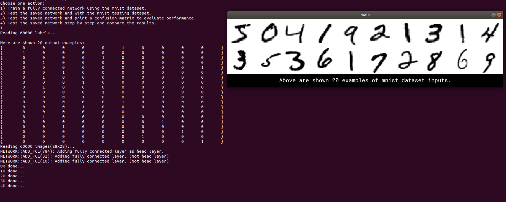
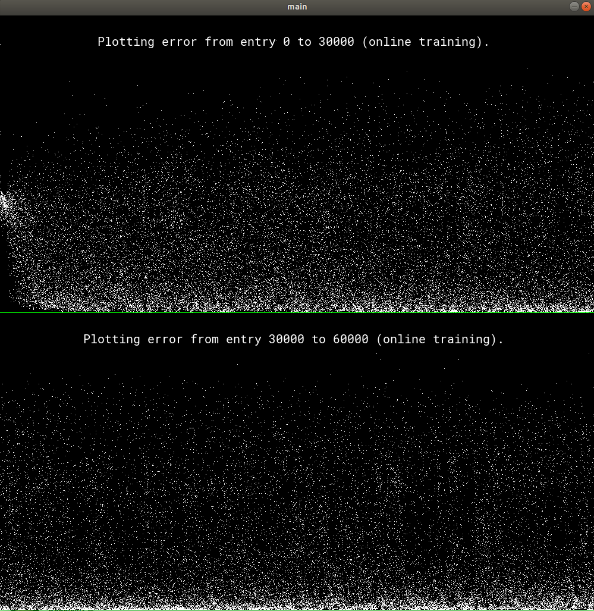
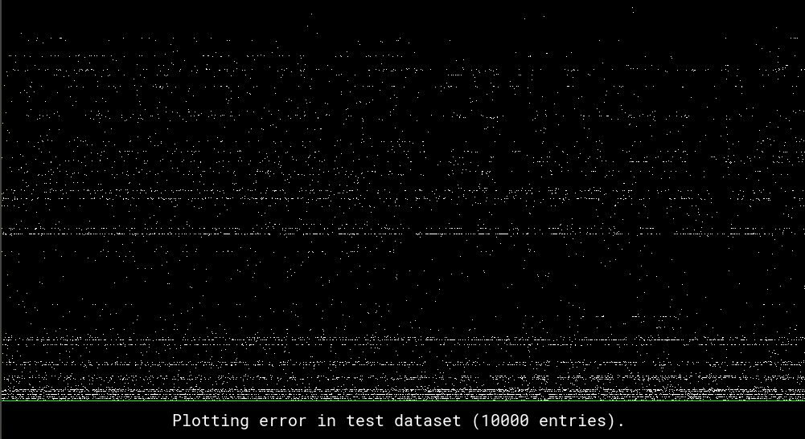
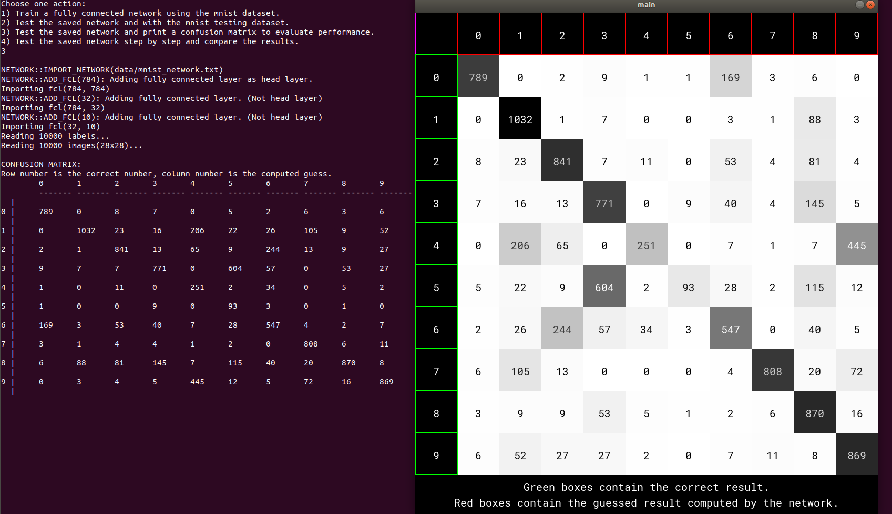
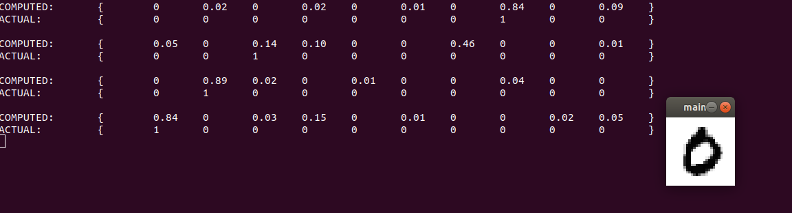

# Fully connected network for digits recognition

The project implements a neural network architecture, built from scratch in c++, and trains and testes it on the popular MNIST dataset of number digits.

## Demos

Upon launch, the program prompts the user to choose one of the available demos.

### 1) Train
Imports the dataset and builds a network to train on it. Prints some training stats and exports the network to a "mnist_network.txt" file.

### 2) Test
Tests the network using the testing dataset and shows error stats.

### 3) Test - confusion matrix
Shows a confusion matrix based on the test dataset.

### 4) Single step testing
Shows the test dataset entry by entry, letting the user compare the results of the network with the image input and expected output.

## Implementation details
The Network and Layer classes have been coded with network customization in mind. While the complete program only lets the user play some demos, the Network class is designed to let the user build networks of variable number of layers and neurons per layer. In particular the export and import methods are general as well, and let the user save any kind of trained networks.

## Prerequisites
### Libraries
All graphics functions use Allegro 5. You can find info about the library and how to install it [here](https://wiki.allegro.cc/index.php?title=Getting_Started).
### Files
The data folder should contain all four MNIST dataset files decompressed. You can find them [here](http://yann.lecun.com/exdb/mnist/).

The folder should also contain the font file fileRobotoMono-Regular.ttf, available [here](https://fonts.google.com/specimen/Roboto+Mono).

## TODO
Many features could be added to expand the program and build a better network for digit recognition.
For example after generalizing the Layer class, softmax and convolutional layers could be implemented.
Also rather than only using one kind of activation function (sigmoid) it would be interesting to implement some way to try out other popular functions and see how they compare.

